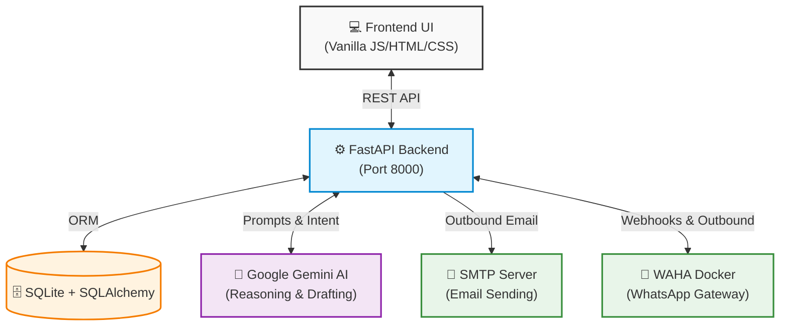

<div align="center">

# 🟢 SentinelGrid

**The Agentic Spreadsheet & Communication Platform**

[](https://www.python.org/)
[](https://fastapi.tiangolo.com/)
[](https://ai.google.dev/)
[](https://waha.devlikeapro.com/)
[](https://opensource.org/licenses/MIT)

*Upload a spreadsheet. Write a prompt. Let AI draft personalized messages, send them, and manage replies — completely automatically.*

[**Explore the Docs**](#-api-reference) · [**Report Bug**](https://github.com/your-username/SentinelGrid/issues) · [**Request Feature**](https://github.com/your-username/SentinelGrid/issues)

</div>

---

## ⚡ The Problem

Managing bulk communications (like event reminders, sales outreach, or feedback collection) usually means toggling between clunky spreadsheets, email clients, and WhatsApp. Automation tools exist, but they are rigid and impersonal. If someone replies to your automated message, the automation breaks and you're forced to step in manually.

### 💡 The SentinelGrid Solution

**SentinelGrid** bridges the gap between structured data and human-like conversation. It turns your spreadsheet data into hyper-personalized, context-aware outbound campaigns over **WhatsApp** and **Email**. 

Powered by **Google Gemini**, SentinelGrid doesn't just send messages. It reads inbound replies, understands the context, extracts meaningful data updates, and seamlessly updates your system. When the AI is uncertain, it flags the conversation for a **Human-in-the-Loop** review.

## ✨ Core Features

* 🚀 **Agentic Personalization:** Google Gemini drafts a unique, contextually rich message for every single row in your dataset based on a master prompt.
* 🌐 **Multi-Channel Dispatch:** Intelligently routes messages via **WhatsApp** (using WAHA) or **Email** (via Gmail SMTP) based on available contact details.
* 🧠 **Smart Reply Ingestion:** Webhooks capture inbound replies. The AI analyzes the intent and extracts data updates directly from the conversation.
* 🛡️ **Confidence-Based Human Review:** Low-confidence AI extractions are flagged in a beautiful Review Queue dashboard instead of auto-updating your database, ensuring 100% data integrity.
* 📊 **Real-time Master Dashboard:** Track pending, sent, replied, and flagged operations at a glance.
* 🔐 **Secure by default:** Built-in Google OAuth 2.0.

---

## 🏗️ Architecture



### 🔁 The Workflow

1. **Upload** a CSV/XLSX file and define a target objective (Master Prompt).
2. **Draft** — Gemini reads every row and dynamically generates localized, tailored messages.
3. **Dispatch** — Messages are routed via WhatsApp or Email.
4. **Listen** — WAHA Webhooks stream incoming WhatsApp replies back to the SentinelGrid backend.
5. **Analyze** — The agent categorizes replies (e.g., *Confirmed*, *Asking for reschedule*) and proposes data state changes.
6. **Review** — Discrepancies drop into the Human-in-the-Loop review queue.

---

## 🚀 Getting Started

### Prerequisites

To run SentinelGrid locally, you will need:
- **Python 3.10+**
- **Docker** (Required for the WhatsApp gateway)
- A **Google Cloud Project** with OAuth 2.0 configured
- A **Gemini API Key** ([Get it here](https://aistudio.google.com/apikey) - Free Tier available)
- A **Gmail App Password** (for SMTP)

### 1. Clone & Setup

```bash
git clone https://github.com/your-username/SentinelGrid.git
cd SentinelGrid

# Create and activate virtual environment
python -m venv .venv
source .venv/bin/activate  # macOS/Linux
# OR
.venv\Scripts\activate     # Windows

# Install dependencies
pip install -r requirements.txt
```

### 2. Environment Variables

Create your environment file:

```bash
cp .env.example .env
```
Edit `.env` and add your keys (OAuth, Gemini, SMTP, etc.).

### 3. Launch the WhatsApp Gateway (WAHA)

SentinelGrid uses the open-source WAHA engine to bridge HTTP to WhatsApp.

```bash
docker run -d \
  --name waha \
  -p 3000:3000 \
  -e WHATSAPP_DEFAULT_ENGINE=WEBJS \
  -e WAHA_API_KEY_PLAIN=mykey123 \
  devlikeapro/waha
```
> **Action Required**: Navigate to `http://localhost:3000` and scan the QR code with your WhatsApp app to establish the connection.

### 4. Start the Application

**Start the Backend (FastAPI)**
```bash
cd backend
python -m uvicorn app.main:app --reload --port 8000
```
*API available at `http://localhost:8000` | Swagger UI at `http://localhost:8000/docs`*

**Start the Frontend**
```bash
# In a new terminal
cd frontend
python -m http.server 8501
```
*Frontend available at `http://localhost:8501`*

---

## 📡 API Reference

Here are the primary integration points for SentinelGrid:

| Domain | Method | Endpoint | Description |
|---|---|---|---|
| **Auth** | `GET` | `/auth/login` | Redirects to Google OAuth consent screen |
| **Campaigns** | `POST` | `/campaigns` | Upload a dataset to create a new agentic campaign |
| **Campaigns** | `POST` | `/campaigns/{id}/launch` | Trigger the AI drafting and message dispatch process |
| **Reviews** | `GET` | `/campaigns/{id}/reviews` | Fetch low-confidence interactions for human review |
| **Reviews** | `POST` | `/campaigns/{id}/rows/{row_id}/review` | Resolve an AI flagged message (Approve/Reject) |
| **Webhooks** | `POST` | `/webhooks/whatsapp` | Registered endpoint for WAHA inbound messages |

---

## 🤝 Contributing

We love contributions! If you'd like to improve SentinelGrid:

1. Fork the Project
2. Create your Feature Branch (`git checkout -b feature/AmazingFeature`)
3. Commit your Changes (`git commit -m 'Add some AmazingFeature'`)
4. Push to the Branch (`git push origin feature/AmazingFeature`)
5. Open a Pull Request

## 📄 License

Distributed under the MIT License. See `LICENSE` for more information.

---
<div align="center">
  <i>Built with ❤️ using FastAPI, Google Gemini & WAHA</i>
</div>
