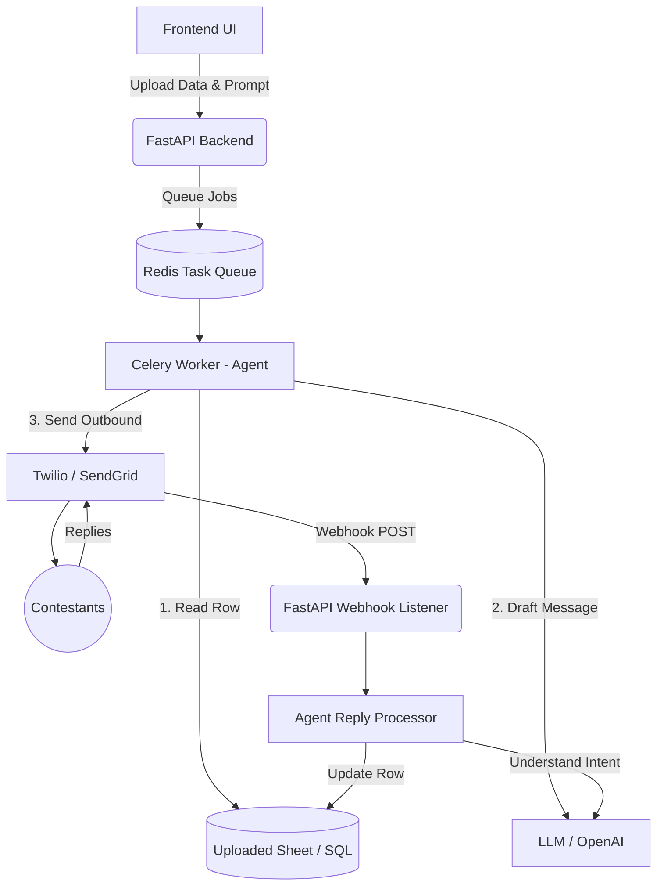

# Architecture Proposal: Agentic Spreadsheet & Communication Platform

## 1. High-Level System Flow

1. **Ingestion & Setup:** The user logs into the UI and uploads a data source (CSV, Excel) or provides SQL Database credentials. The user provides a master prompt (e.g., *"Send each contestant their individual start times and ask them to confirm availability"*).
2. **Processing & Outbound:** The backend processes the data into manageable chunks. The Agent reads each row, uses the LLM to draft a highly personalized message based on the row's data, and dispatches the message via Email or WhatsApp.
3. **Tracking State:** The system stores a temporary state in a database, mapping the sent message (and recipient's contact info) to the specific row in the dataset, so it knows who is replying later.
4. **Inbound Replies (Webhooks):** When a contestant replies, the communication provider (WhatsApp/Email API) sends an HTTP POST request (Webhook) to your backend.
5. **Agentic Update:** The system receives the reply, looks up the corresponding row in the dataset, and feeds the reply back to the Agent. The Agent extracts the relevant update (e.g., "Yes, I am available") and uses a tool to update the spreadsheet or database automatically.

---

## 2. Technology Stack Recommendation

| Component | Recommended Technology | Why? |
| :--- | :--- | :--- |
| **Frontend UI** | **Next.js (React)** or **Streamlit** | Streamlit is incredibly fast for building data/AI internal tools. Next.js is better if you want a polished, customer-facing SaaS. |
| **Backend API** | **Python + FastAPI** | Python is mandatory because the best Agentic frameworks and Data manipulation libraries (Pandas) are all Python-native. FastAPI is blazingly fast and supports async webhook handling. |
| **Agent Framework** | **LangGraph** or **Pydantic AI** | You need an agent that supports **State** and **Human-in-the-loop** interactions. LangGraph is perfect for cyclic, stateful workflows that wait for external triggers (user replies). |
| **Data Processing** | **Pandas** & **SQLAlchemy** | Pandas can parse almost any tabular format (XLSX, CSV). SQLAlchemy safely connects to external SQL databases. |
| **Task Queue** | **Celery** + **Redis** | You cannot process hundreds of rows synchronously. The background task queue will handle the heavy lifting of sending out messages slowly to avoid API rate limits. |
| **Database (State)** | **PostgreSQL** or **SQLite** | To keep track of which phone number/email belongs to which row so the agent can properly map replies to updates. |

---

## 3. Communication Providers (APIs)

To send and *receive* messages, you must use Cloud API providers that support **Inbound Webhooks**.

### WhatsApp
* **Twilio API for WhatsApp:** Extremely easy to set up for two-way messaging.
* **Meta WhatsApp Cloud API:** Official API, slightly harder to set up but much cheaper at scale.

### Email
* **SendGrid / Resend / Mailgun:** These platforms allow you to send emails and configure **Inbound Parse Ingress**. When someone replies to your email (e.g., `replies@yourdomain.com`), the service parses the email body and sends it as a JSON payload to your FastAPI backend.

---

## 4. System Architecture Diagram (Conceptual)

---

## 5. Deployment Architecture (Dockerized)

Using Docker simplifies deployment, scaling, and environment consistency. The entire stack can be orchestrated using `docker-compose`:

1. **Containerized Services:**
   * **FastAPI Backend:** Runs the web server and webhook listeners.
   * **Celery Worker:** Runs the background task queue and the Agent.
   * **Redis:** In-memory store for the Celery message broker.
   * **PostgreSQL:** Persistent database for maintaining conversational state.
   * **Frontend:** (Optional) Container for the Next.js or Streamlit UI.
2. **Reverse Proxy (Nginx / Traefik):**
   * A containerized Nginx or Traefik instance handles incoming HTTP/HTTPS traffic, automatically manages SSL certificates (via Let's Encrypt), and routes webhooks to the FastAPI backend.
3. **Orchestration:**
   * A single `docker-compose.yml` file defines all these services, networks, and volumes (for DB persistence). Deployment is as simple as running `docker-compose up -d`.

## 6. Edge Cases to Account For

* **Rate Limits:** WhatsApp and Email providers strictly limit how many messages you can send per second. Your Task Queue (Celery) must have rate-limiting enabled to slowly drip the messages.
* **Hallucinations:** The Agent shouldn't be allowed to blindly overwrite the DB if it misunderstands a reply. Implement a "Confidence Score" using Structured Outputs (Pydantic). If confidence is low, the UI should flag the row for manual human review first.
* **Data Privacy:** Users are uploading sensitive PII (Phone numbers, emails, names). Ensure the raw files are either encrypted at rest or automatically deleted after the campaign is completed.
